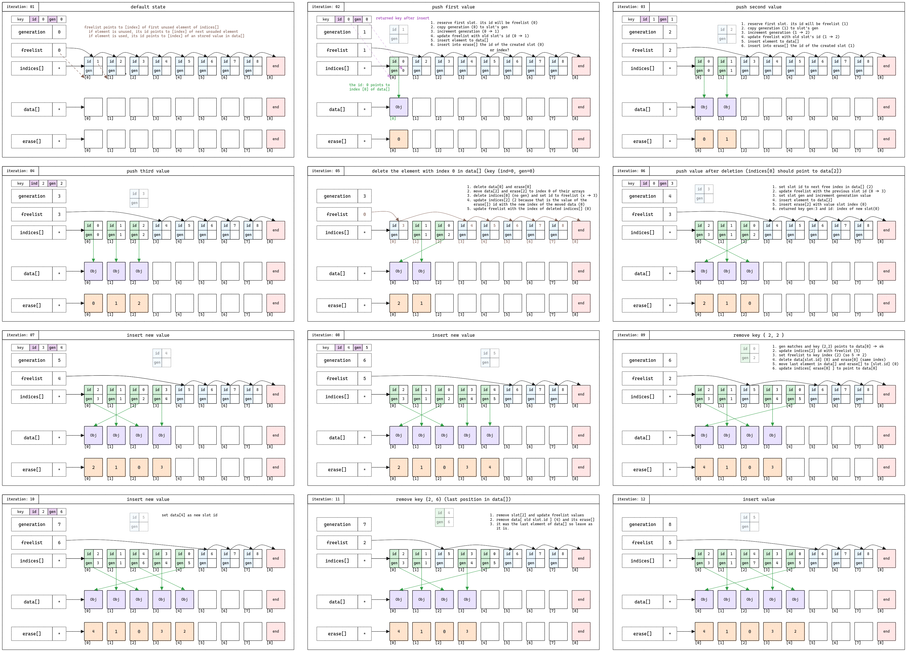

* 功能
A slot map is an associative container that stores data contiguously in memory and provides an indirect access layer to maintain stable references to the data. It facilitates efficient insertion, removal, and retrieval of elements, ensuring that the data is stored in an array-like structure with no gaps.

